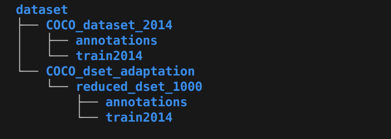

# NeuralSegmentello

NeuralSegmentello is a deep learning framework for refining coarse object segmentation masks into high-precision segmentations. The task is performed via U-Net-based architectures, given a rough user-provided binary mask (simulating a brush stroke) and the original image. The system returns a refined mask with accurate object contours.

Check out the full project explanation in the [**Project Report (PDF)**](./NeuralSegmentello.pdf).


# Dependencies Installation

### Using uv (recommended)

If you have [`uv`](https://docs.astral.sh/uv/) installed, simply run:
```sh
uv sync
```

--------------------------------------------------------------

### Using pip
You can also set up a virtual environment manually and install dependencies with pip.

Create a virtual environment:
```sh
python -m venv .venv
```

Activate it:
```sh
# macOS / Linux
source .venv/bin/activate

# Windows
.venv\Scripts\activate
```

Install dependencies using pip:

```sh
pip install -r requirements.txt
```
or install the whole project (-e for editable mode)
```sh
pip install -e .
```

# Dataset
We used a reduced version of the *COCO Dataset 2014* due to limited computational power. In the following there is an explanation of what we did.

1. Install the whole coco dataset in the `dataset/` folder. Here our folder structure to better understand:

    
    
    Download links:
    - **images** (train2014): 
        https://images.cocodataset.org/zips/train2014.zip
    - **annotations**:
        https://images.cocodataset.org/annotations/annotations_trainval2014.zip
<br>
2. Once the full coco dataset is in `dataset/COCO_dataset_2014` we reduced the dataset running:
    ```sh
    python src/segmentello/reducing_dset.py
    ```
    This creates a reduced version of the dataset with the first 1000 images at the path
    `dataset/COCO_dset_adaptation/reduced_dset_1000`

**Notes:**
- You can change the number of images in the reduced version of the dataset and all the relative paths in `src/segmentello/data/config.py` file
- If you want to use the whole dataset you can simply change the dataset path in the same config file

# Authors

| [<br><sub>**Andrea Gentilini**</sub>](https://github.com/andrea-gentilini) | [<br><sub>**Michele Magrini**</sub>](https://github.com/mich1803) | [<br><sub>**Leo Vincenzo Petrarca**</sub>](https://github.com/leopetra20) | [<br><sub>**Iacopo Scandale**</sub>](https://github.com/IacopoScandale) |
|:---:|:---:|:---:|:---:|


